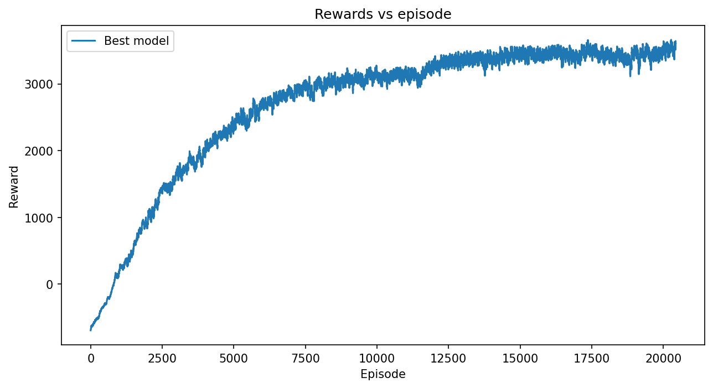

# PPO-Learning on Cheetah-v5

Impements PPO [Schulman et al., 2017](https://arxiv.org/pdf/1707.06347) to train a continuous-control agent on HalfCheetah-v5. Includes a hyperparameter sweep across learning rate, network layer sizes, and update epochs, with a data analysis notebook for evaluating results.

## Requirements

- Python 3.10

## Installation

### 1. Clone repository
**HTTPS:**
```bash
git clone https://github.com/George-Peregoy/PPO-Learning.git
cd PPO-Learning
```

**SSH:**
```bash
git clone git@github.com:George-Peregoy/PPO_Learning.git
cd PPO-Learning
```

### 2. Install python dependencies

```bash
pip install -r requirements.txt
```

** Required Packages:**
- gymnasium[mujoco]==1.2.3
- numpy==2.2.6
- torch==2.11.0
- matplotlib==3.10.8
- ipykernel==7.2.0
- moviepy==2.2.1
- imageio-ffmpeg==0.6.0

## Package structure

The main python files are in src/, data analysis is done on notebooks/, model params are stored in checkpoints/, and rewards tracking is stored in metrics/.

```bash
ppo_learning/
├── src/
│   ├── agent.py          
│   ├── network.py        
│   └── utils.py          
├── notebooks/
│   └── data_analysis.ipynb  
├── checkpoints/          
├── metrics/              
├── videos/               
├── config.py             
├── train.py              
├── test.py               
├── requirements.txt
└── README.md
```

### Python Files

- `agent.py` - Defines RL agent.
- `network.py` - General NN class made in pytorch.
- `utils.py` - Holds functions for making environment, getting state and action dimensions as well as a smoothing function for data analysis
- `train.py` - Trains agent on environment. Sweeps agent configs to tune hyperparameters, saves model params and metrics.
- `test.py` - Tests trained model on environment, saves run as a video in videos/.

### Notebook
- `data_analysis.ipynb` - Imports metrics and plots rewards vs episodes for each parameter of interest. Used to find configuration of final model.

## Configuration

config.py holds the baseline configuration, of which the parameters that vary are listed below.

- `BUFFER_SIZE = 4096` - Amount of data stored before updating agent.
- `BASELINE['lr'] = 3e-4` - Baseline learning rate of actor and critic networks.
- `BASELINE['actor_layer_sizes'] = [STATE_DIM, 256, 256, ACTION_DIM]` - Sizes of actor network layers.
- `BASELINE['critic_layer_sizes'] = [STATE_DIM, 256, 256, 1]` - Sizes of critic network layers.
- `BASELINE['k_epochs'] = 10` - Number of times agent is trained on same data.

## Usage
To train an agent run `python3 train.py`.

To test the trained agent run `python3 test.py`.

## Results

### Training Curve


### Hyperparameter Sweep
| Parameter | Values Tested | Best |
|-----------|--------------|------|
| Learning Rate | 1e-4, 3e-4, 1e-3 | 1e-4 |
| Layer Sizes | 64x64, 128x128, 256x256 | 256x256 |
| K Epochs | 10, 15, 20 | 20 |

### Final Model
Average reward over 30 evaluation episodes: **4462.73**

### Evaluation
[Trained policy](videos/HalfCheetah-v5/rl-video-episode-0.mp4)
